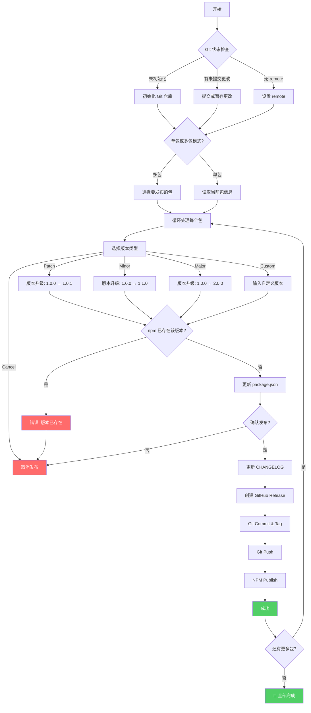

# @vyron/release

> 一站式发布流水线，支持 Git、NPM、GitHub Release 自动化管理

## 特性

- **交互式发布** - 友好的命令行交互，选择版本类型和 commit message
- **多包支持** - 支持 monorepo 一次性发布多个包
- **版本校验** - 自动检查 npm 是否已有该版本，避免重复发布
- **CHANGELOG** - 自动生成/更新 CHANGELOG.md
- **GitHub Release** - 自动创建 GitHub Release 和 Release Notes
- **发布确认** - 发布前二次确认，避免误操作
- **自动回滚** - 发布失败时自动回滚版本号
- **进度反馈** - 所有操作都有清晰的进度和结果提示
- **错误重试** - 网络操作失败自动重试（最多 3 次）
- **Dry Run** - 预览模式，不实际执行任何操作

## Install

```bash
pnpm add @vyron/release
```

## Quick Start

```typescript
import { release } from "@vyron/release";

// 交互式发布
await release();

// 指定版本类型
await release({ releaseAs: "patch" });

// 预览模式
await release({ dryRun: true });
```

## CLI Usage

```bash
# 交互式发布
pnpm release

# 指定版本类型
pnpm release --minor
pnpm release --patch
pnpm release --major

# 指定自定义版本
pnpm release --custom 2.0.0

# 预览模式
pnpm release --dry-run

# 跳过确认
pnpm release --skip-confirm

# 发布后跳过 GitHub Release
pnpm release --skip-github-release

# 发布后跳过 CHANGELOG
pnpm release --skip-changelog

# 跳过 Git Push
pnpm release --skip-push

# 跳过 NPM Publish
pnpm release --skip-publish
```

## API

### `release(options?)`

发布新版本。

```typescript
import { release } from "@vyron/release";

await release({
  // 工作目录，默认 process.cwd()
  cwd: process.cwd(),

  // 预览模式，不实际发布
  dryRun: false,

  // 发布类型: patch | minor | major | custom
  // 或直接指定版本号如 "2.0.0"
  releaseAs: "patch",

  // 自定义 commit message
  commitMessage: "feat: add new feature",

  // 跳过各步骤
  skipPublish: false,
  skipPush: false,
  skipConfirm: false,
  skipChangelog: false,
  skipGithubRelease: false,

  // 发布单个包（路径）
  package: "./packages/my-package",

  // 配置文件（见下文）
  config: {
    parallel: false,
    changelog: { output: "CHANGELOG.md" },
    githubRelease: { draft: false },
  },
});
```

### Options

| Option              | Type      | Default         | Description          |
| ------------------- | --------- | --------------- | -------------------- |
| `cwd`               | `string`  | `process.cwd()` | 工作目录             |
| `dryRun`            | `boolean` | `false`         | 预览模式，不实际执行 |
| `releaseAs`         | `string`  | 交互选择        | 发布类型或指定版本   |
| `commitMessage`     | `string`  | 自动生成        | Git commit message   |
| `skipPublish`       | `boolean` | `false`         | 跳过 NPM 发布        |
| `skipPush`          | `boolean` | `false`         | 跳过 Git Push        |
| `skipConfirm`       | `boolean` | `false`         | 跳过发布确认         |
| `skipChangelog`     | `boolean` | `false`         | 跳过 CHANGELOG 更新  |
| `skipGithubRelease` | `boolean` | `false`         | 跳过 GitHub Release  |
| `package`           | `string`  | 自动选择        | 指定发布的包路径     |
| `config`            | `object`  | -               | 配置文件             |

## Configuration

在项目根目录创建 `.releaserc.json` 或 `release.config.js`：

### `.releaserc.json`

```json
{
  "parallel": false,
  "changelog": {
    "output": "CHANGELOG.md"
  },
  "githubRelease": {
    "draft": false,
    "prerelease": false
  }
}
```

### `release.config.js`

```javascript
export default {
  parallel: false,
  changelog: {
    output: "CHANGELOG.md",
  },
  githubRelease: {
    draft: false,
    prerelease: false,
  },
};
```

### Config Options

| Key                        | Type      | Description          |
| -------------------------- | --------- | -------------------- |
| `parallel`                 | `boolean` | 多包发布时并行执行   |
| `changelog.output`         | `string`  | CHANGELOG 文件路径   |
| `githubRelease.draft`      | `boolean` | 创建为 Draft Release |
| `githubRelease.prerelease` | `boolean` | 创建为 Pre-release   |

## Programmatic API

### `release(options?)`

主入口函数，详见上文。

### `readPkg(cwd?)`

读取 package.json 信息。

```typescript
import { readPkg } from "@vyron/release";

const pkg = readPkg("./packages/my-package");
// pkg.name    - 包名
// pkg.version - 版本号
// pkg.path    - package.json 路径
```

### `writePkg(cwd, version)`

更新 package.json 版本号。

```typescript
import { writePkg } from "@vyron/release";

writePkg("./packages/my-package", "2.0.0");
```

### `calculateNewVersion(currentVersion, releaseType)`

计算新版本号。

```typescript
import { calculateNewVersion } from "@vyron/release";

calculateNewVersion("1.0.0", "patch"); // "1.0.1"
calculateNewVersion("1.0.0", "minor"); // "1.1.0"
calculateNewVersion("1.0.0", "major"); // "2.0.0"
calculateNewVersion("1.0.0", "2.0.0"); // "2.0.0"
```

### `isValidVersion(version)`

验证版本号是否合法。

```typescript
import { isValidVersion } from "@vyron/release";

isValidVersion("1.0.0"); // true
isValidVersion("1.0.0-beta"); // true
isValidVersion("invalid"); // false
```

## Workflow

发布流程：



### 流程说明

| 步骤           | 说明                                      | 可跳过                  |
| -------------- | ----------------------------------------- | ----------------------- |
| Git 状态检查   | 检查仓库状态，提示初始化/提交/设置 remote | 否                      |
| 选择包         | 多包模式下选择要发布的包                  | 单包模式自动跳过        |
| 版本选择       | 选择 patch/minor/major 或自定义版本       | 可指定 `releaseAs`      |
| 版本检查       | 验证 npm 是否已有该版本                   | 否                      |
| 发布确认       | 二次确认是否发布                          | `--skip-confirm`        |
| CHANGELOG      | 自动更新 CHANGELOG.md                     | `--skip-changelog`      |
| GitHub Release | 创建 GitHub Release 和 Release Notes      | `--skip-github-release` |
| Git Commit     | 提交更改并打标签                          | 否                      |
| Git Push       | 推送到远程仓库                            | `--skip-push`           |
| NPM Publish    | 发布到 npm                                | `--skip-publish`        |

## Error Handling

发布过程中遇到错误会自动回滚版本号更改。

常见错误提示：

| 错误                      | 原因             | 解决方案                    |
| ------------------------- | ---------------- | --------------------------- |
| `未找到 package.json`     | 工作目录不正确   | 使用 `cwd` 选项指定正确路径 |
| `版本 x.x.x 已存在于 npm` | 该版本已发布     | 使用新的版本号              |
| `npm publish 失败`        | 未登录 npm       | 运行 `npm login`            |
| `git push 失败`           | 网络问题或无权限 | 检查网络或 Git 配置         |
| `版本格式不正确`          | 包名不符合规范   | 确保符合 npm 包名规范       |

## Environment Variables

| Variable       | Description                        |
| -------------- | ---------------------------------- |
| `GITHUB_TOKEN` | GitHub API Token，用于创建 Release |
| `npm_token`    | npm 认证 Token                     |

## Best Practices

1. **使用 Dry Run 测试** - 首次使用时先用 `--dry-run` 预览效果

2. **配置文件管理** - 在项目中添加 `.releaserc.json` 统一团队配置

3. **版本号规范** - 遵循 semver 规范：
   - `patch` - Bug 修复
   - `minor` - 新功能（向后兼容）
   - `major` - 破坏性变更

4. **Commit Message** - 使用有意义的 commit message，便于生成 changelog

5. **GITHUB_TOKEN** - 创建 GitHub Release 需要设置环境变量

## License

MIT
